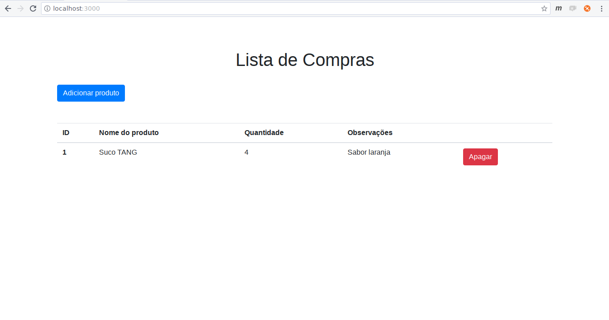
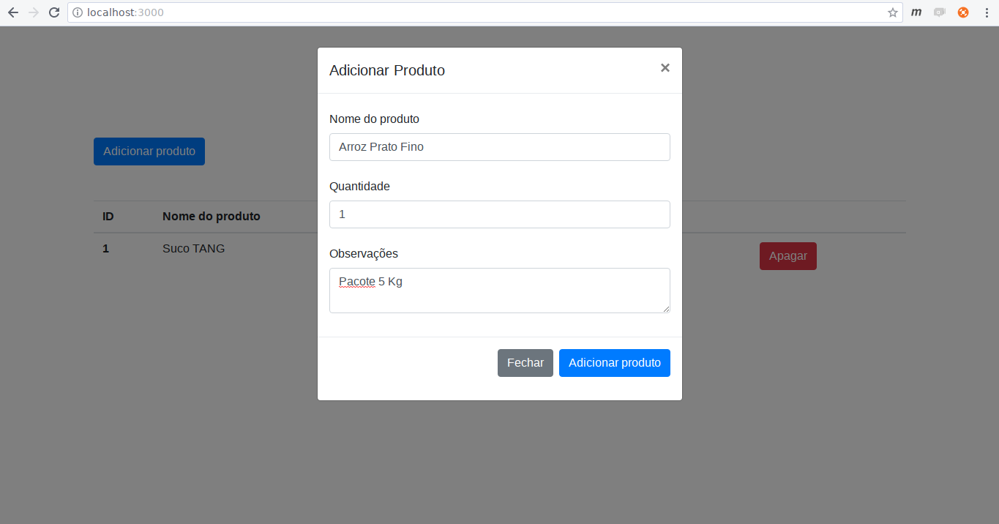
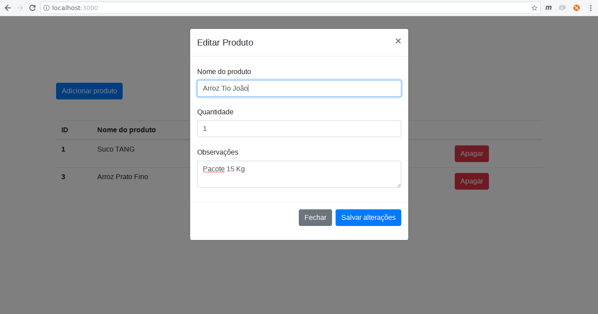
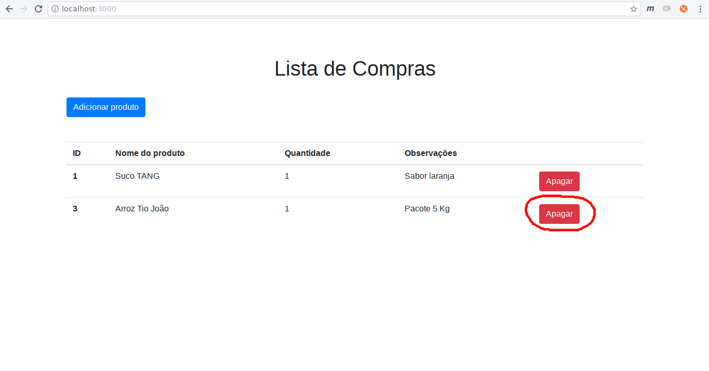

# Projeto Final - Banco de Dados I
Foi desenvolvida uma aplicação para controlar a lista de compras de uma determinada família. Quando vamos ao supermercado, sempre fazemos aquela famosa listinha. Por que não transformar isso em uma aplicação web?

## Pré-requisitos
O projeto foi desenvolvido utilizando duas tecnologias:
1. [PostgreSQL](https://www.postgresql.org/)
2. [Nodejs (Javascript)](https://nodejs.org/en/)
3. [Node Package Manager (npm)](https://www.npmjs.com/)

## Instalação
#### Instalando o NodeJS (Ubuntu)
Abra o terminal e digite o comando de instalação do node:
```
sudo apt-get install nodejs
```
Certifique-se da instalação conferindo a versão do NodeJS instalada 
```
node -v 
```
#### Instalando o npm
Abra o terminal e digite o comando de instalação do npm:
```
sudo apt-get install npm
```
Certifique-se da instalação conferindo a versão do npm instalada 
```
npm -v 
```

## Execução
> **Nota:** Todos os comandos SQL estão no arquivo fonte.
> 
Faça o download ou clone o repositório em um diretório de sua preferência.

Primeiramente, vamos configurar o banco de dados e a conxão com o banco. Utilizando o Postres, crie um database chamado *family_silva*
```sql
CREATE DATABASE family_silva
```
Execute o script para a criação da tabela e inserção de um dado inicial
```sql
CREATE  TABLE shopping_list (
	id SERIAL  PRIMARY  KEY,
	name  VARCHAR(300) NOT  NULL,
	amount INTEGER  NOT  NULL,
	obs TEXT
);

INSERT  INTO shopping_list (name, amount, obs)
VALUES ('Suco TANG', 4, 'Sabor laranja');
```
Pronto. Agora, vamos configurar a conexão com o database que acabamos de criar. No arquivo ***app.js*** do código fonte, encontre o seguinte trecho de código:
```javascript
// Parametros de conexão com o banco
const pool =  new pg.Pool({
	user: 'postgres',
	host: 'localhost',
	database: 'family_silva',
	password: '123456',
	port: '5432'
});
```
**Importante:** Estes são os parâmetros para a conexão com o banco. Caso algum parâmetro seja diferente, como usuário, senha ou até mesmo o nome do banco, modifique esta parte do código de acordo com sua configuração.

Com a conexão configurada, abra o terminal e navegue até o diretório do codigo fonte
```
cd caminho/para/tplbd-node-pedro-e-artur
```
Precisamos instalar as dependências utilizadas no projeto. Para isso, execute o script (dentro da pasta raíz do projeto)
```
npm install
```
Com as dependencias instaladas, execute o arquivo node para rodar a aplicação, com o seguinte comando:
```
node app.js
```
Por fim, abra o seu navegador em ***http://localhost:3000/***
Você deverá visualizar a seguinte tela:


A aplicação está rodando!

## CRUD
1. Create - Adicionando um produto



2. Read - Exibindo os dados


3. Update - Atualizando um produto



4. Delete - Removendo um produto



## Trigger

É impossível comprar um produto com quantidade negativa, certo? Criamos uma trigger para resolver isso, que não insere o produto caso um valor inválido seja passado como parâmetro
```sql
CREATE OR REPLACE FUNCTION less_than_one()
  RETURNS TRIGGER AS
  $$
    DECLARE
      valor INTEGER;
    BEGIN
      IF (new.amount < 1 ) THEN
		raise notice 'Quantidade informada menor do que zero: %', new.amount;
		DELETE FROM shopping_list sl WHERE new.amount = sl.amount;
      END IF;
      RETURN NULL;
    END;
  $$
LANGUAGE 'plpgsql';

CREATE TRIGGER trigger_add
  AFTER INSERT
  ON shopping_list
  FOR EACH ROW
  EXECUTE PROCEDURE less_than_one();
```
## Autores
- Arthur Novaes
- Pedro Matias